# 🤖 Intelligent AI Resume Analyzer & Career Assistant

An AI-powered web application that analyzes resumes, evaluates ATS compatibility, matches resumes with job descriptions, generates interview questions, and rewrites resumes using **Google Gemini AI**.

Built with **Java, Spring Boot, Spring MVC, JSP, Hibernate, MySQL, and Google Gemini AI**.

---

## 📌 Overview

The **Intelligent AI Resume Analyzer & Career Assistant** helps users analyze and improve their resumes using Artificial Intelligence.

The application extracts text from PDF resumes and uses Google Gemini AI to provide personalized career insights.

### What users can do

- 📄 Analyze resumes using AI
- 📊 Generate ATS scores
- 🧠 Identify skills, strengths, weaknesses, and missing skills
- 🎯 Match resumes with job descriptions
- 📚 Identify skill and experience gaps
- 🎤 Generate job-specific interview questions
- ✍️ Rewrite resumes for target jobs
- 🗂️ Maintain resume analysis history

---

## ✨ Key Features

| Feature | Description |
|---|---|
| 🔐 User Authentication | Registration, login, logout and session management |
| 📄 Resume Analysis | AI-powered resume analysis and ATS evaluation |
| 🎯 Job Matching | Compare resume with job descriptions |
| 🎤 Interview Generator | Generate job-specific interview questions |
| ✍️ Resume Rewriter | Improve resume content for a target job |
| 📚 Resume History | View previous resume analyses and ATS scores |

---

## 🧠 Google Gemini AI

Google Gemini AI powers the main intelligent features of the application:

- Resume Analysis
- ATS Evaluation
- Job Description Matching
- Interview Question Generation
- Resume Rewriting

The Gemini API key is loaded through an environment variable and is **not hard-coded in the source code**.

---

## 🛠️ Technology Stack

| Category | Technologies |
|---|---|
| Language | Java 21 |
| Backend | Spring Boot 3.5.5, Spring MVC |
| Frontend | JSP, HTML5, CSS3, JavaScript, Bootstrap |
| ORM | JPA, Hibernate |
| Database | MySQL 8 |
| AI | Google Gemini AI |
| Build Tool | Maven |
| Server | Apache Tomcat |
| IDE | Eclipse / Spring Tool Suite |
| Version Control | Git, GitHub |

---

## 🏗️ System Architecture

The application follows a layered web application architecture.

```text
                         ┌──────────────────┐
                         │       User       │
                         └────────┬─────────┘
                                  │
                                  ▼
                         ┌──────────────────┐
                         │   JSP Frontend   │
                         │ HTML/CSS/Bootstrap│
                         └────────┬─────────┘
                                  │
                                  ▼
                         ┌──────────────────┐
                         │   Spring MVC     │
                         │   Controllers    │
                         └────────┬─────────┘
                                  │
              ┌───────────────────┼───────────────────┐
              │                   │                   │
              ▼                   ▼                   ▼
       ┌─────────────┐     ┌─────────────┐     ┌─────────────┐
       │    User     │     │   Resume    │     │  Gemini AI  │
       │   Module    │     │   Module    │     │   Service   │
       └──────┬──────┘     └──────┬──────┘     └──────┬──────┘
              │                   │                   │
              │                   │                   ▼
              │                   │            ┌──────────────┐
              │                   │            │ Google Gemini│
              │                   │            │      AI      │
              │                   │            └──────────────┘
              │                   │
              └───────────────────┼───────────────────┐
                                  ▼                   │
                         ┌──────────────────┐         │
                         │      MySQL       │◄────────┘
                         │     Database     │
                         └──────────────────┘
```

---

## 🔄 Application Workflow

### Resume Analysis

```text
Upload PDF
    ↓
Extract Resume Text
    ↓
Google Gemini AI
    ↓
ATS & Resume Analysis
    ↓
Display Results
    ↓
Save Analysis History
```

### Job Matching

```text
Resume + Job Description
          ↓
     Gemini AI
          ↓
Skill & Experience Comparison
          ↓
Gaps & Recommendations
          ↓
     Final Assessment
```

### Interview Preparation

```text
Resume + Job Details
          ↓
       Gemini AI
          ↓
Job-Specific Questions
```

### Resume Rewriting

```text
Existing Resume
      +
Target Job
      +
Job Description
      ↓
Google Gemini AI
      ↓
Improved Resume Content
```

---

## 📸 Screenshots

### 📝 Registration

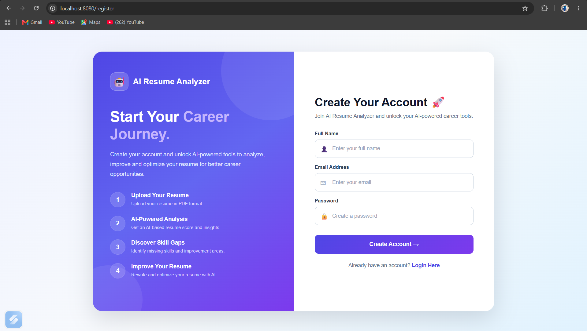

### 🔐 Login

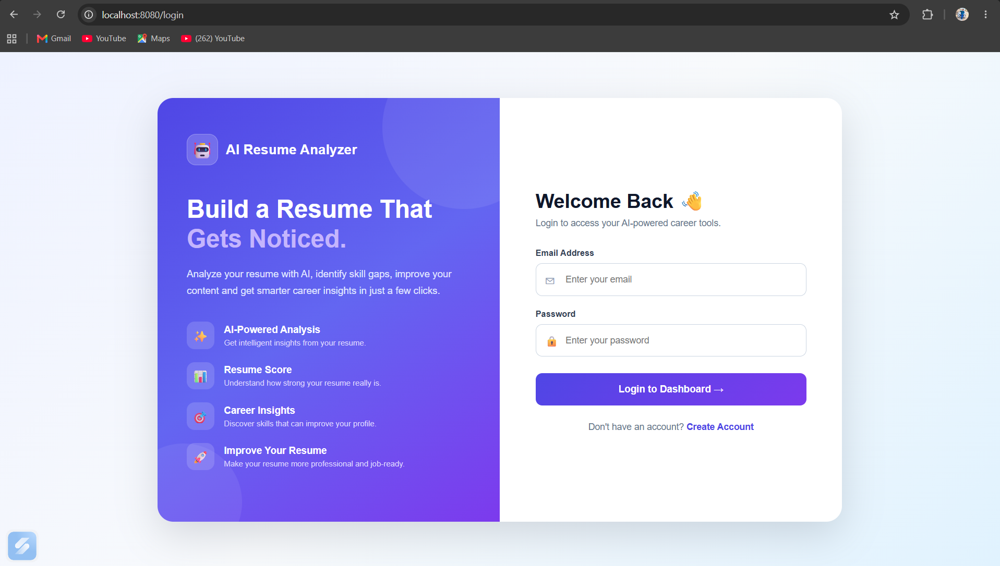

### 🏠 Home

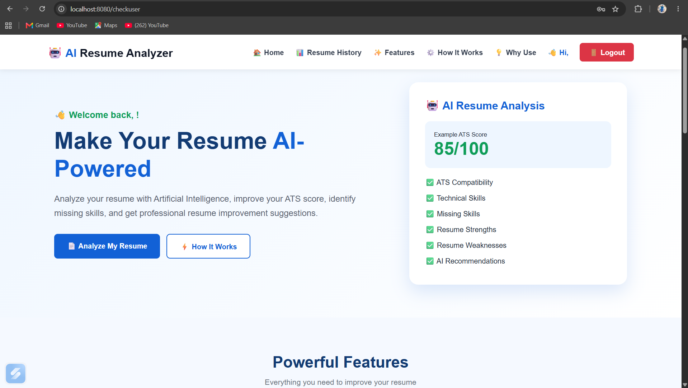

### ✨ Features

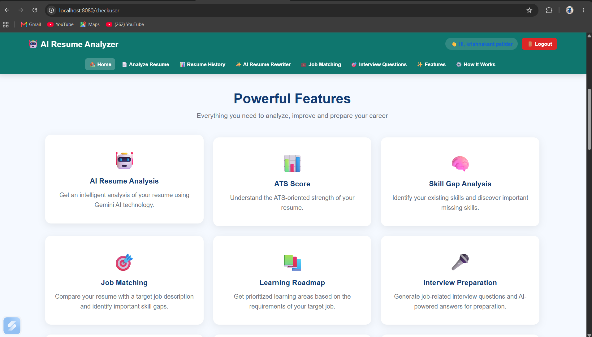

### 📤 Upload Resume

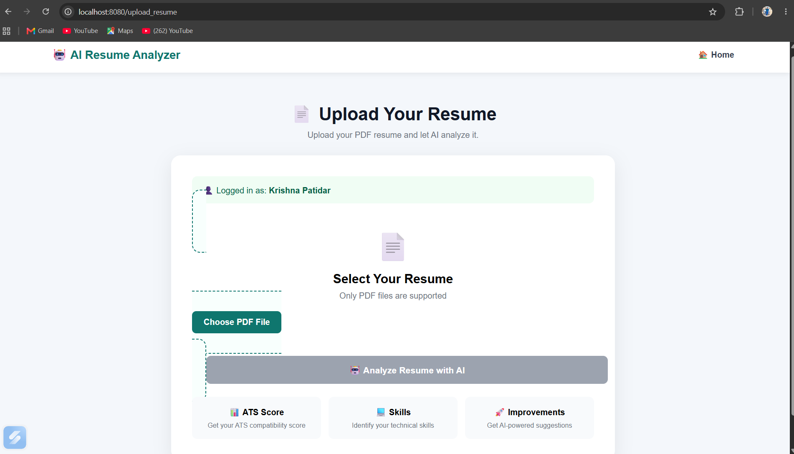

### ✅ Upload Success

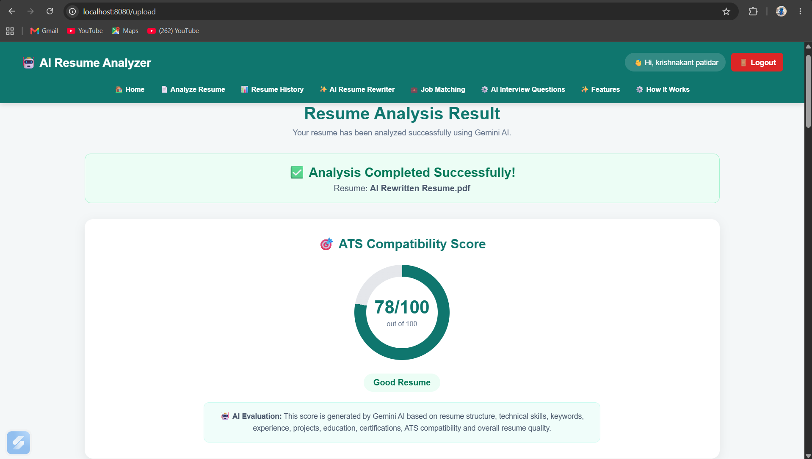

### 📚 Resume History

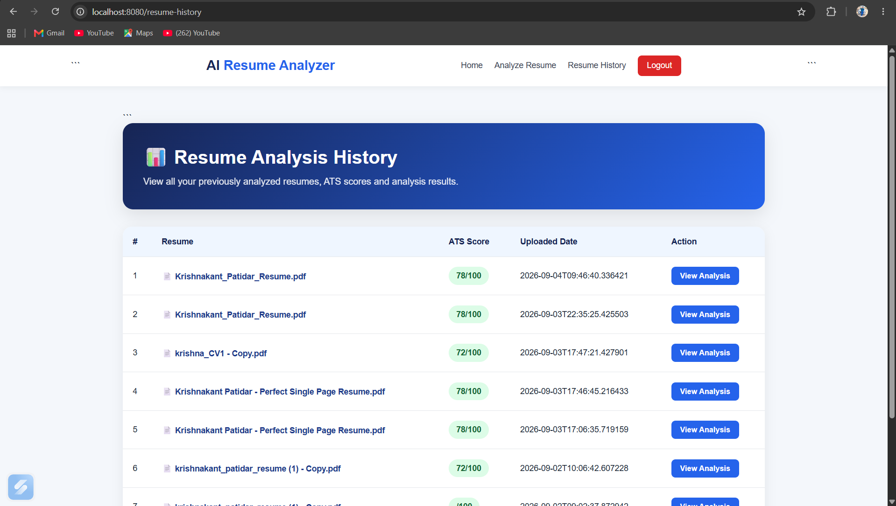

### ✍️ Resume Rewriter

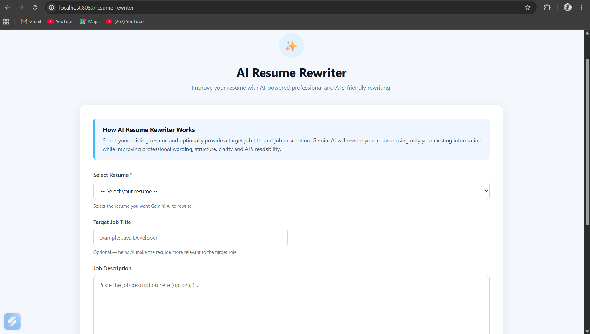

### 🎯 Job Matching

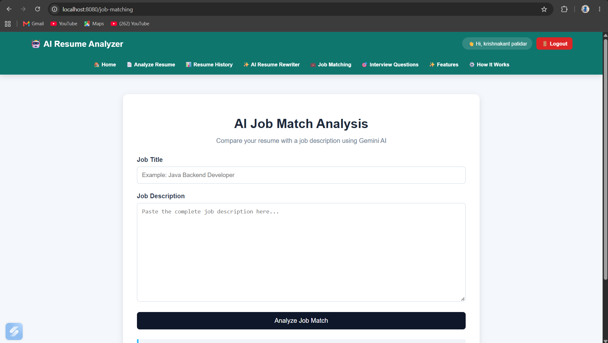

### 🎤 Interview Questions

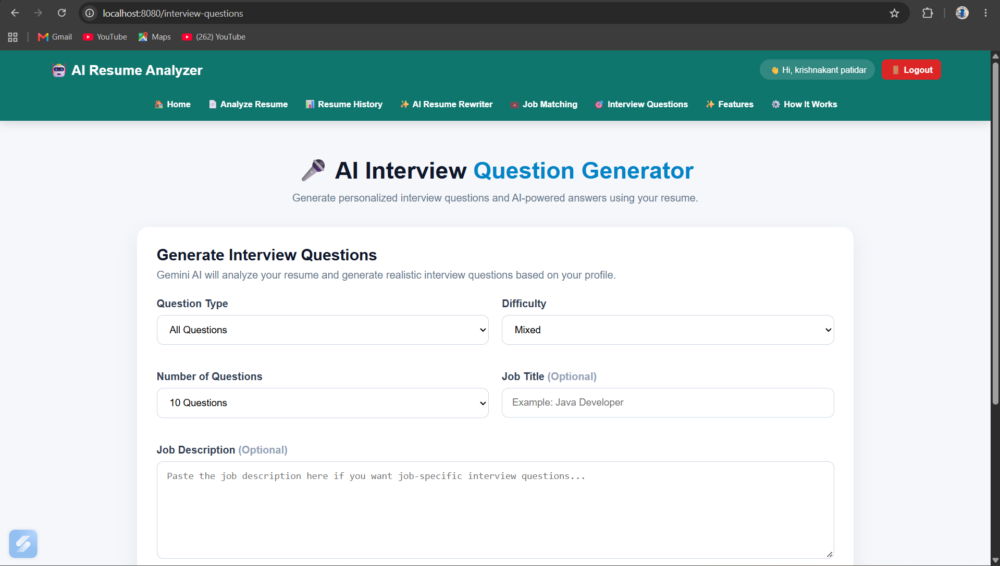

### 📊 Job Match Result

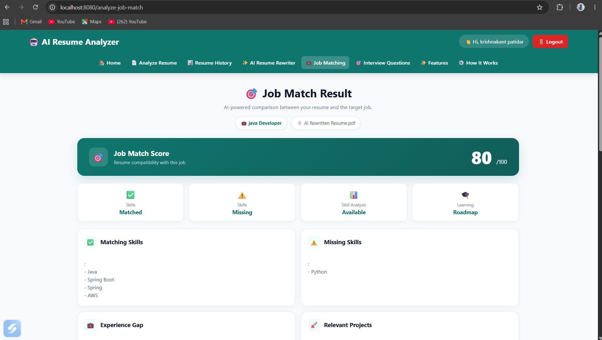

---

## 🗄️ Database

The application uses **MySQL** for persistent data storage.

Database:

```text
ai_resume_analyzer
```

The database stores:

- User information
- Uploaded resume records
- ATS scores
- AI analysis results
- Resume history

---

## 📁 Project Structure

```text
Intelligent-AI-Resume-Analyzer-And-Career-Assistant/
│
├── .mvn/
├── screenshots/
│   ├── register.png
│   ├── login.png
│   ├── home.png
│   ├── feature.png
│   ├── feature-2.png
│   ├── upload-resume.png
│   ├── upload-success.png
│   ├── resume-history.png
│   ├── resume-rewrite.png
│   ├── job-matching.png
│   ├── interview-question.png
│   └── job-match-result.png
│
├── src/
│   ├── main/
│   └── test/
│
├── .gitignore
├── LICENSE
├── mvnw
├── mvnw.cmd
├── pom.xml
└── README.md
```

---

## 🔐 Environment Variables

The application uses environment variables for sensitive configuration.

```text
DB_USERNAME
DB_PASSWORD
GEMINI_API_KEY
```

These values should **never be hard-coded or committed to GitHub**.

---

## 🚀 How to Run

### 1. Clone Repository

```bash
git clone https://github.com/krishnapatidar80/Intelligent-AI-Resume-Analyzer-And-Career-Assistant.git
```

### 2. Create Database

```sql
CREATE DATABASE ai_resume_analyzer;
```

### 3. Configure Environment Variables

```text
DB_USERNAME=your_mysql_username
DB_PASSWORD=your_mysql_password
GEMINI_API_KEY=your_gemini_api_key
```

### 4. Build Project

Windows:

```powershell
.\mvnw.cmd clean install
```

### 5. Run Application

```powershell
.\mvnw.cmd spring-boot:run
```

### 6. Open in Browser

```text
http://localhost:8080
```

---

## 📦 Main Modules

- **User Authentication** — Registration, login and session management
- **Resume Analysis** — AI-powered resume and ATS analysis
- **Job Matching** — Resume and job description comparison
- **Interview Generator** — AI-generated interview questions
- **Resume Rewriter** — AI-powered resume improvement
- **Resume History** — Previous analysis records

---

## 🎓 Learning Outcomes

This project provided practical experience in:

- Java Full Stack Development
- Spring Boot & Spring MVC
- JSP Web Development
- Hibernate / JPA
- MySQL
- Google Gemini AI Integration
- PDF Text Processing
- Session Management
- Git & GitHub
- Environment Variable Management
- AI-powered application development

---

## 🔮 Future Enhancements

- Cloud deployment
- Resume PDF generation
- Job recommendation system
- Advanced ATS scoring
- Resume templates
- Analytics dashboard
- Admin dashboard
- Additional AI models

---

## 👨‍💻 Author

### Krishnakant Patidar

**MCA Student | Java Full Stack Developer**

- GitHub: [krishnapatidar80](https://github.com/krishnapatidar80)
- LinkedIn: [Krishnakant Patidar](https://www.linkedin.com/in/krishnakant-patidar-3358772b9/)
- Portfolio: [krishnapatidar80.github.io/portfolio](https://krishnapatidar80.github.io/portfolio/)

---

## 📄 License

This project is licensed under the **MIT License**.

See the [LICENSE](LICENSE) file for details.

---

⭐ If you find this project useful, consider giving the repository a star.

**Built with Java, Spring Boot, JSP, MySQL and Google Gemini AI.**