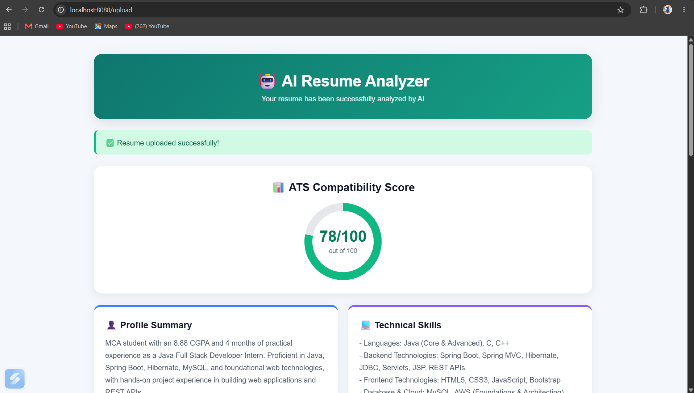

\# 🤖 AI Resume Analyzer


\*\*AI Resume Analyzer\*\* is an AI-powered web application that analyzes resumes using \*\*Google Gemini AI\*\* and generates an \*\*ATS (Applicant Tracking System) score\*\*, detailed feedback, strengths, weaknesses, and improvement suggestions.


Built using \*\*Java, Spring Boot, Spring MVC, JSP, Hibernate, MySQL, and Google Gemini AI\*\*.


\---


\## 📌 Project Overview


Recruiters often use ATS software to filter resumes before manual review. Missing keywords, poor structure, or unclear information can reduce a resume's chances of getting shortlisted.


\*\*AI Resume Analyzer\*\* helps users evaluate and improve their resumes by providing AI-generated ATS analysis.


\### Users can:


\- Create an account and login

\- Upload resumes in PDF format

\- Extract resume text automatically

\- Analyze resumes using Google Gemini AI

\- Generate an ATS score

\- View strengths and weaknesses

\- Get personalized improvement suggestions

\- View previous resume analyses through Resume History


\---


\## ✨ Features


\### 🔐 User Authentication

\- User Registration

\- User Login

\- Session-based authentication

\- User Logout

\- User-specific resume data


\### 📄 Resume Management

\- PDF Resume Upload

\- PDF Text Extraction

\- Resume Data Storage

\- User-wise Resume Management


\### 🤖 AI Resume Analysis

\- Google Gemini AI Integration

\- ATS Score Generation

\- Technical Skill Analysis

\- Keyword Analysis

\- Resume Strengths \& Weaknesses

\- Improvement Suggestions

\- Resume Structure Analysis


\### 📊 Resume History

\- View previously analyzed resumes

\- View ATS scores

\- View upload date and time

\- View detailed previous analysis


\### 🗄️ Database

\- MySQL Integration

\- JPA \& Hibernate ORM

\- User–Resume Relationship

\- One user can have multiple resumes


\---


\## 🛠️ Tech Stack


| Category | Technologies |

|---|---|

| \*\*Language\*\* | Java 21 |

| \*\*Backend\*\* | Spring Boot 3.5.5, Spring MVC |

| \*\*ORM\*\* | JPA, Hibernate |

| \*\*Frontend\*\* | JSP, HTML5, CSS3, JavaScript, Bootstrap, JSTL |

| \*\*Database\*\* | MySQL 8 |

| \*\*AI\*\* | Google Gemini AI API |

| \*\*Build Tool\*\* | Maven |

| \*\*Server\*\* | Apache Tomcat |

| \*\*IDE\*\* | Eclipse / Spring Tool Suite |

| \*\*Version Control\*\* | Git, GitHub |


\---


\## 🏗️ Project Architecture


The application follows a \*\*layered architecture\*\*:


```text

&#x20;                        ┌───────────────────┐

&#x20;                        │       User        │

&#x20;                        └─────────┬─────────┘

&#x20;                                  │

&#x20;                                  ▼

&#x20;                        ┌───────────────────┐

&#x20;                        │    JSP Frontend   │

&#x20;                        └─────────┬─────────┘

&#x20;                                  │

&#x20;                                  ▼

&#x20;                        ┌───────────────────┐

&#x20;                        │   Spring MVC      │

&#x20;                        │   Controllers     │

&#x20;                        └─────────┬─────────┘

&#x20;                                  │

&#x20;                   ┌──────────────┼──────────────┐

&#x20;                   │              │              │

&#x20;                   ▼              ▼              ▼

&#x20;            ┌────────────┐ ┌────────────┐ ┌─────────────┐

&#x20;            │   User     │ │  Resume    │ │   Gemini    │

&#x20;            │  Service   │ │  Service   │ │   Service   │

&#x20;            └─────┬──────┘ └─────┬──────┘ └──────┬──────┘

&#x20;                  │              │                │

&#x20;                  │              │                ▼

&#x20;                  │              │        ┌──────────────┐

&#x20;                  │              │        │ Gemini AI API│

&#x20;                  │              │        └──────────────┘

&#x20;                  │              │

&#x20;                  └──────────────┼───────────────┐

&#x20;                                 ▼               │

&#x20;                          ┌─────────────┐         │

&#x20;                          │    MySQL    │◄────────┘

&#x20;                          │   Database  │

&#x20;                          └─────────────┘

```


\---


\## 🔄 How It Works


```text

User Registration

&#x20;      ↓

User Login

&#x20;      ↓

Home Dashboard

&#x20;      ↓

Upload Resume PDF

&#x20;      ↓

Extract Resume Text

&#x20;      ↓

Send Resume Data to Gemini AI

&#x20;      ↓

AI Resume Analysis

&#x20;      ↓

Generate ATS Score

&#x20;      ↓

Display Analysis Result

&#x20;      ↓

Save Result in MySQL

&#x20;      ↓

Resume History

```


\---


\## 🧠 AI Resume Analysis


Google Gemini AI analyzes the extracted resume content and evaluates:


\- Technical Skills

\- Education

\- Projects

\- Experience

\- Keywords

\- Achievements

\- Resume Structure

\- ATS-related factors


The application then displays the AI-generated analysis and ATS score.


\---


\## 📊 ATS Score


The application generates an AI-based ATS score from the resume analysis.


Example:


```text

ATS Score: 85/100


Strengths:

✓ Good technical skills

✓ Relevant projects

✓ Clear education section


Areas for Improvement:

• Add measurable achievements

• Improve project descriptions

• Add relevant job-specific keywords

• Improve resume optimization

```


> The ATS score and analysis are generated dynamically by AI based on the uploaded resume.


\---


\## 🗄️ Database Design


The application uses \*\*MySQL\*\* to store user and resume information.


\### Users Table


```text

users\_detailes

│

├── id

├── name

├── email

└── password

```


\### Resumes Table


```text

resumes

│

├── id

├── file\_name

├── resume\_text

├── resume\_score

├── analysis\_result

├── uploaded\_at

└── user\_id

```


\### Relationship


```text

Users

&#x20; │

&#x20; │ 1

&#x20; │

&#x20; │

&#x20; │ N

&#x20; ▼

Resumes

```


\*\*One user can have multiple resumes.\*\*


The `user\_id` field establishes the relationship between users and their resumes.


\---


\## 🔐 API Key Security


The Gemini API key is \*\*not hard-coded\*\* in the application.


The project uses an environment variable:


```properties

gemini.api-key=${GEMINI\_API\_KEY}

```


Configure the key on your local system:


```text

GEMINI\_API\_KEY=YOUR\_GEMINI\_API\_KEY

```


> ⚠️ Never commit or publish your actual API key or database password to GitHub.


\---


\## ⚙️ Installation \& Setup


\### 1. Clone the Repository


```bash

git clone https://github.com/krishnapatidar80/AI-Resume-Analyzer.git

cd AI-Resume-Analyzer

```


\### 2. Create MySQL Database


```sql

CREATE DATABASE ai\_resume\_analyzer;

```


\### 3. Configure MySQL


Update your local database credentials in:


```text

src/main/resources/application.properties

```


Example:


```properties

spring.datasource.url=jdbc:mysql://localhost:3306/ai\_resume\_analyzer

spring.datasource.username=root

spring.datasource.password=YOUR\_MYSQL\_PASSWORD

```


> Do not upload your actual database password to GitHub.


\### 4. Configure Gemini API Key


Set the environment variable:


```text

GEMINI\_API\_KEY=YOUR\_GEMINI\_API\_KEY

```


The application reads it through:


```properties

gemini.api-key=${GEMINI\_API\_KEY}

```


\### 5. Build the Project


```bash

mvn clean install

```


\### 6. Run the Application


```bash

mvn spring-boot:run

```


You can also run the application directly using \*\*Eclipse / Spring Tool Suite\*\*.


\---


\## 🌐 Application Pages


| Page | Description |

|---|---|

| 🏠 \*\*Home\*\* | Main dashboard and application features |

| 🔐 \*\*Login\*\* | User authentication |

| 📝 \*\*Registration\*\* | New user account creation |

| 📄 \*\*Upload Resume\*\* | Upload PDF resume for analysis |

| 📊 \*\*Analysis Result\*\* | ATS score, strengths, weaknesses and suggestions |

| 📚 \*\*Resume History\*\* | Previously analyzed resumes and scores |


\---


\## 📸 Screenshots


\### 🔐 Login Page


\---


\### 🏠 Home Dashboard


\---


\### 📄 Resume Upload


\---


\### 📊 AI Resume Analysis Result





\---


\### 📚 Resume Analysis History


\---


\## 💻 Project Structure


```text

AI-Resume-Analyzer

│

├── src

│   ├── main

│   │   ├── java

│   │   │   └── com.aIresumeanalyzer

│   │   │       ├── controller

│   │   │       ├── dao

│   │   │       ├── daoimpl

│   │   │       ├── entity

│   │   │       ├── repository

│   │   │       └── service

│   │   │

│   │   ├── resources

│   │   │   └── application.properties

│   │   │

│   │   └── webapp

│   │       └── WEB-INF

│   │           └── views

│   │               ├── home.jsp

│   │               ├── login.jsp

│   │               ├── register.jsp

│   │               ├── upload-resume.jsp

│   │               ├── upload-success.jsp

│   │               └── resume-history.jsp

│   │

│   └── test

│

├── pom.xml

├── .gitignore

├── mvnw

├── mvnw.cmd

└── README.md

```


\---


\## 🎯 Key Learning Outcomes


This project provided practical experience in:


\- Java Backend Development

\- Spring Boot \& Spring MVC

\- Dependency Injection

\- JSP Web Development

\- JPA \& Hibernate

\- MySQL Database Integration

\- Entity Relationships

\- CRUD Operations

\- Session Management

\- PDF Text Extraction

\- REST API Integration

\- Gemini AI API Integration

\- Environment Variable-based Secret Management

\- Maven

\- Git \& GitHub


\---


\## 🚀 Future Enhancements


\- 🎯 Job Description vs Resume Matching

\- 🔍 Keyword Gap Analysis

\- 📊 Advanced ATS Score Visualization

\- 💼 Job-specific Resume Recommendations

\- ✨ AI-powered Resume Improvement

\- 📥 Download Analysis Report as PDF

\- ☁️ AWS Cloud Deployment

\- 📧 Email-based Resume Reports

\- 👨‍💼 Admin Dashboard


\---


\## 👨‍💻 Author


\### Krishnakant Patidar


\*\*MCA Student | Java Full Stack Developer\*\*


\*\*Technical Skills\*\*


```text

Java • Spring Boot • Spring MVC • Hibernate • JPA

MySQL • JSP • JavaScript • HTML • CSS • Bootstrap

REST APIs • Gemini AI • AWS • Git • GitHub

```


\### Profiles


\- \*\*GitHub:\*\* https://github.com/krishnapatidar80

\- \*\*LinkedIn:\*\* https://linkedin.com/in/krishnakant-patidar-3358772b9

\- \*\*Portfolio:\*\* https://krishnapatidar80.github.io/portfolio/


\---


\## ⭐ Project


If you find this project useful, please consider giving it a ⭐ on GitHub.


\---


\## 📜 License


This project is developed for \*\*educational and portfolio purposes\*\*.

